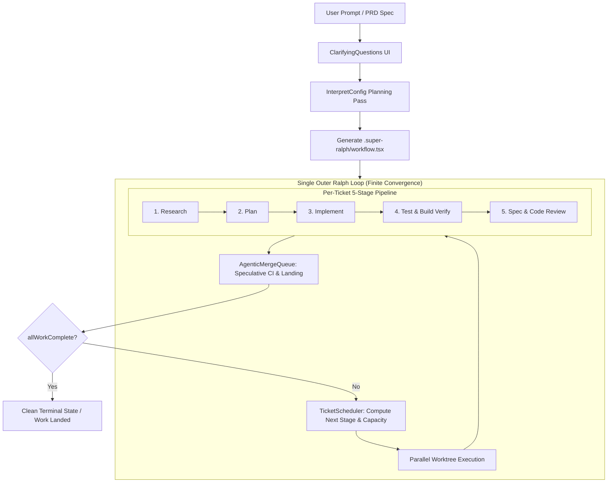

# Super Ralph — Multi-Agent Ticket Orchestration Engine

[](https://bun.sh)
[](https://www.typescriptlang.org)
[](https://smithers.sh)
[](tests/)
[](LICENSE)

> **Super Ralph is the sovereign multi-agent software engineering loop** — an opinionated [Smithers](https://smithers.sh) orchestration engine combining ticket-driven decomposition, parallel task execution across isolated worktrees, multi-agent review gates, and a speculative Jujutsu/Git merge queue into a single finite, self-terminating Ralph loop.

---

## 1. System Architecture



---

## 2. Core Guarantees & Convergence

1. **Finite-by-Default Execution**:
   - Every loop evaluates a live quiescence predicate (`allWorkComplete`).
   - `maxIterations` defaults to `25` with `onMaxReached="fail"` — zero silent runaway loops.
   - Unified on 2026-09-21 into a single outer loop containing scheduling, execution, and merging, guaranteeing deterministic pipeline convergence.
2. **Hermetic Worktree Isolation**:
   - Each ticket executes within an isolated Jujutsu (`jj`) or Git workspace (`/tmp/workflow-wt-<ticketId>`).
   - Speculative merge queue tests concurrent changes before mainline landing.
3. **Multi-Agent Diversity**:
   - Pluggable agent pools (Claude, Codex, Tau, Kimi, local Herd models).
   - Dedicated review gates (`SpecReview`, `CodeReview`, `ReviewFix`) ensure no unverified code reaches the merge queue.

---

## 3. CLI Quickstart

Launch any prompt or specification file directly:

```bash
# Direct task launch
ralph "Build a high-performance SSE event bridge with token budgeting"

# Launch from specification markdown
super-ralph ./specs/feature.md --max-concurrency 8

# Non-interactive / headless CI mode
ralph "Implement SQLite state store" --skip-questions --max-iterations 15

# Dry run (generates .super-ralph/workflow.tsx without executing)
super-ralph ./PROMPT.md --dry-run
```

### CLI Flags

| Flag | Type | Description | Default |
|---|---|---|---|
| `--cwd <path>` | `string` | Target repository root | Current working directory |
| `--max-concurrency <n>` | `number` | Maximum parallel active jobs | `4` (or CPU-bound) |
| `--max-iterations <n>` | `number` | Hard loop ceiling for Ralph convergence | `25` |
| `--skip-questions` | `boolean` | Bypass interactive clarification phase | `false` |
| `--dry-run` | `boolean` | Generate `.super-ralph/` without starting engine | `false` |
| `--run-id <id>` | `string` | Explicit Smithers run identifier | Auto-generated UUID |

---

## 4. Component Hierarchy

```text
super-ralph/
├── src/
│   ├── cli/
│   │   ├── index.ts               # CLI front door, argument parser, workflow generator
│   │   └── clarifications.ts      # Interactive terminal clarification UI
│   ├── components/
│   │   ├── SuperRalph.tsx         # Unified finite Ralph loop container
│   │   ├── TicketScheduler.tsx    # Dynamic priority & capacity scheduler
│   │   ├── Job.tsx                # Worktree execution wrapper
│   │   ├── AgenticMergeQueue.tsx  # Speculative jj/git merge queue component
│   │   ├── ClarifyingQuestions.tsx# Workflow clarification task
│   │   ├── CompletionValidator.tsx# Stage output verifier
│   │   └── TicketResume.tsx       # Cross-run state recovery & durability
│   ├── mergeQueue/
│   │   └── coordinator.ts         # Speculative workspace coordinator
│   ├── prompts/                   # Mdx prompt templates (Research, Plan, Implement, etc.)
│   ├── selectors.ts               # State selectors, ticket extraction, normalization
│   └── schemas.ts                 # Zod output schemas
└── tests/
    ├── finite-default.test.ts     # Loop termination & budget acceptance tests
    ├── exact-reply.test.ts        # Fast-path string normalization tests
    └── prompt-renderer.test.ts    # Prompt compilation & rendering tests
```

---

## 5. Provenance & Lineage

- **Lineage**: Reusable Ralph workflow pattern, fork of `roninjin10/super-ralph`, integrated into the Sovereign Mesh ecosystem (`/home/toxic/sovereign/projects/mesh/super-ralph`).
- **Smithers Orchestration**: Built on `@smithers-orchestrator` v0.32.0, leveraging React-reconciled task graphs with SQLite persistence.
- **Verification**: 42/42 unit & integration tests passing (`bun test`), 0 TypeScript diagnostics (`tsc --noEmit`).
